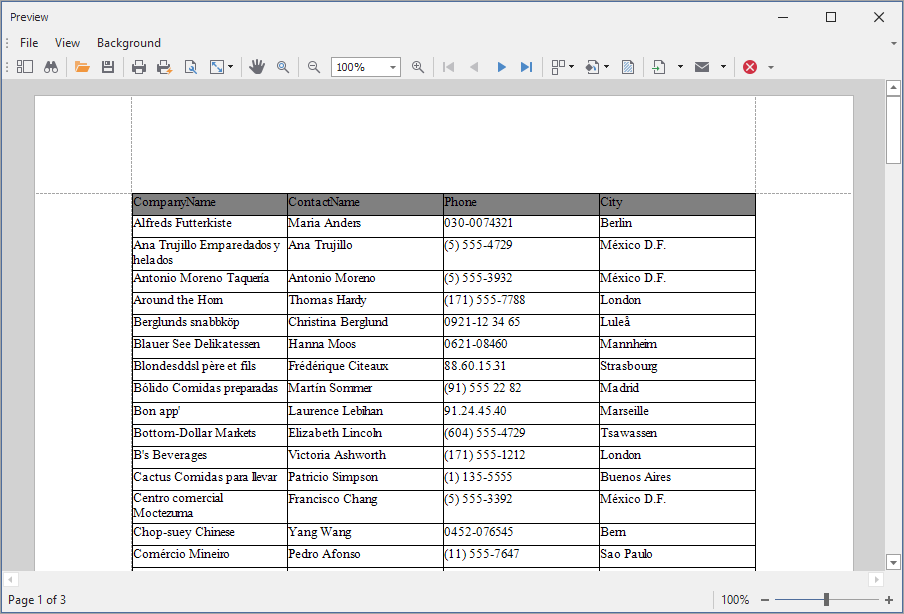

# Reporting for WinForms - Create a Data-Bound Table at Runtime 

This example contains code that creates a report with a data-bound table. You can create a table within a report in the following ways:

- Create a new report instance and add bands/controls to it.
- Call the method that creates a table in the BeforePrint event handler.
- Create a table in the report constructor (call the method in the report's code-behind file).

A table in a report is the [XRTable](https://docs.devexpress.com/XtraReports/DevExpress.XtraReports.UI.XRTable) reporting control. You should
add this control to the collection of controls for a specific [report band](https://docs.devexpress.com/XtraReports/2587/detailed-guide-to-devexpress-reporting/introduction-to-banded-reports). Populate the [row collection](https://docs.devexpress.com/XtraReports/DevExpress.XtraReports.UI.XRTable.Rows), and add cells to the [cell collection](https://docs.devexpress.com/XtraReports/DevExpress.XtraReports.UI.XRTableRow.Cells) for each row. Enclose all row and cell collection modifications within the [XRTable.BeginInit](https://docs.devexpress.com/XtraReports/DevExpress.XtraReports.UI.XRTable.BeginInit) and [XRTable.EndInit](https://docs.devexpress.com/XtraReports/DevExpress.XtraReports.UI.XRTable.EndInit) method pair.

Use the [XRTableCell.ExpressionBindings](https://docs.devexpress.com/XtraReports/DevExpress.XtraReports.UI.XRControl.ExpressionBindings) property to bind a cell to a data field.

Explicitly specify the **XRTable** control width. When you add rows and cells to the table, their widths are adjusted to fit the table width.

Explicitly specify the table height only if you do not expect cell content to exceed the cell height. If the [XRTableCell.CanGrow](https://docs.devexpress.com/XtraReports/DevExpress.XtraReports.UI.XRTableCell.CanGrow) option is enabled, the cell can grow to display the entire content.

<!-- default file list -->

## Files to Look At

* [Form1.cs](CS/Form1.cs) (VB: [Form1.vb](VB/Form1.vb))
* [TableReport.cs](CS/TableReport.cs) (VB: [TableReport.vb](VB/TableReport.vb))

<!-- default file list end -->

## Documentation

- [Create Reports in Code](https://docs.devexpress.com/XtraReports/115726/detailed-guide-to-devexpress-reporting/reporting-api/create-reports-in-code)
- [Use Tables](https://docs.devexpress.com/XtraReports/9741/detailed-guide-to-devexpress-reporting/use-report-controls/use-tables)
- [Advanced Grid Printing and Exporting](https://docs.devexpress.com/WindowsForms/114962/controls-and-libraries/data-grid/export-and-printing/advanced-grid-printing-and-exporting)

